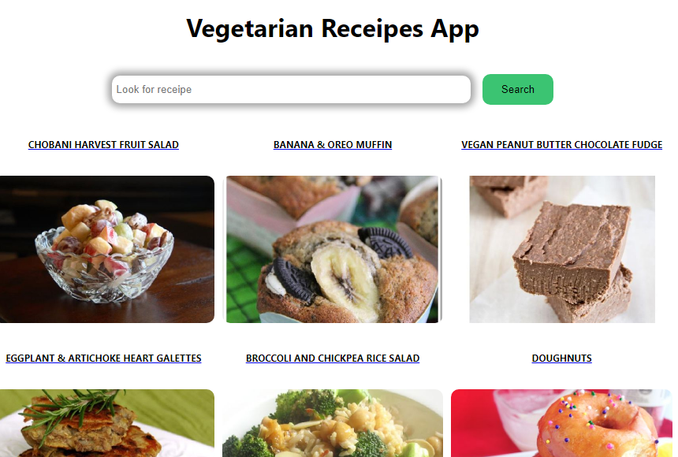

# Receipes App - React project


## About The Project



This is my third project for s2i platform. Here I've used React library creating a small app for vegetarian people.
It is possible to make a research of vegetarian receipes by typing the ingredient in the search bar.
You will see a list of receipes got from [Spoonacular Api](https://spoonacular.com/). Then, clicking on the result you go straight to the page where you can find ingredients and instruction for cooking.


## Using Receipes App

To use the Receipes App, follow these steps:

```
press inside the search bar
type the name of the ingredient you looking for
press the button search to check if there are receipes with the ingredient you want
click on the result and read ingredients and instructions 

```
You can find the app deployed on github pages at the address https://aline89b.github.io/receipesAppReact/.

### Built With


## Getting Started

This is an example of how you may give instructions on setting up your project locally.
To get a local copy up and running follow these simple example steps.

### Prerequisites

This is an example of how to list things you need to use the software and how to install them.
* npm
  ```sh
  npm install npm@latest -g
  ```

### Installation

1. Get a free API Key at [https://spoonacular.com](https://spoonacular.com)
2. Clone the repo
   ```sh
   git clone https://github.com/Aline89b/receipesAppReact.git
   ```
3. Install NPM packages
   ```sh
   npm install
   ```
4. Enter your API in `config.js`
   ```js
   const API_KEY = 'ENTER YOUR API';
   ```

## Contributing

Contributions are what make the open source community such an amazing place to learn, inspire, and create. Any contributions you make are **greatly appreciated**.

If you have a suggestion that would make this better, please fork the repo and create a pull request. You can also simply open an issue with the tag "enhancement".
Don't forget to give the project a star! Thanks again!

1. Fork the Project
2. Create your Feature Branch (`git checkout -b feature/AmazingFeature`)
3. Commit your Changes (`git commit -m 'Add some AmazingFeature'`)
4. Push to the Branch (`git push origin feature/AmazingFeature`)
5. Open a Pull Request

## Contact

If you want to contact me you can reach me at <a.grianti89@gmail.com>.

